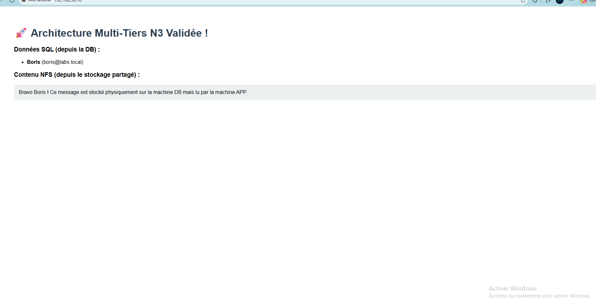

# Infrastructure Multi-VM avec Vagrant N3

Ce projet configure un environnement de laboratoire complet avec trois machines virtuelles basées sur **AlmaLinux 9**, conçu pour simuler une architecture trois tiers (3-tier) classique.

## Architecture du Laboratoire



L'infrastructure se compose des trois machines suivantes connectées via un réseau privé (`192.168.56.0/24`) :

1.  **Proxy (Frontend)** :
    *   **Hostname** : `proxy.labs.local`
    *   **IP** : `192.168.56.10`
    *   **Rôle** : Reverse Proxy (Nginx attendu)
2.  **App (Backend)** :
    *   **Hostname** : `app.labs.local`
    *   **IP** : `192.168.56.11`
    *   **Rôle** : Serveur d'applications
3.  **DB (Database)** :
    *   **Hostname** : `db.labs.local`
    *   **IP** : `192.168.56.12`
    *   **Rôle** : Base de données (PostgreSQL) et Serveur de stockage (NFS)

## Prérequis

*   [Vagrant](https://www.vagrantup.com/downloads) installé sur votre machine.
*   [VirtualBox](https://www.virtualbox.org/) installé en tant que provider.

## Déploiement

Pour démarrer l'ensemble de l'infrastructure, exécutez la commande suivante à la racine du projet :

```bash
vagrant up
```

## Accès aux Machines

Vous pouvez vous connecter à chaque machine individuellement via SSH :

```bash
# Pour le proxy
vagrant ssh proxy

# Pour l'application
vagrant ssh app

# Pour la base de données
vagrant ssh db
```

## Nettoyage

Pour arrêter et supprimer les machines virtuelles :

```bash
vagrant destroy -f
```

---
*Projet généré pour l'apprentissage de l'administration Linux et des architectures réseaux.*
